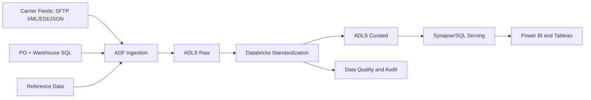
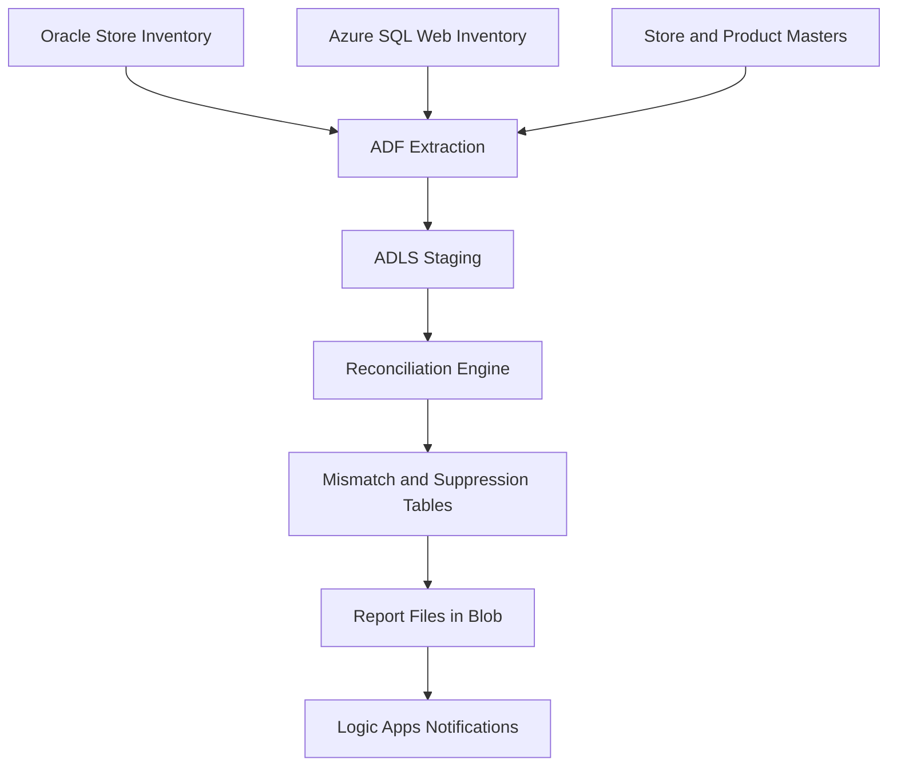
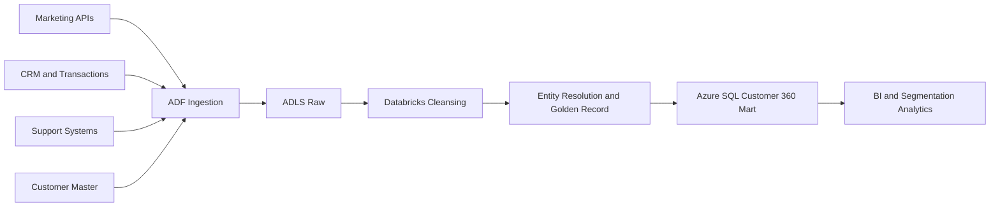
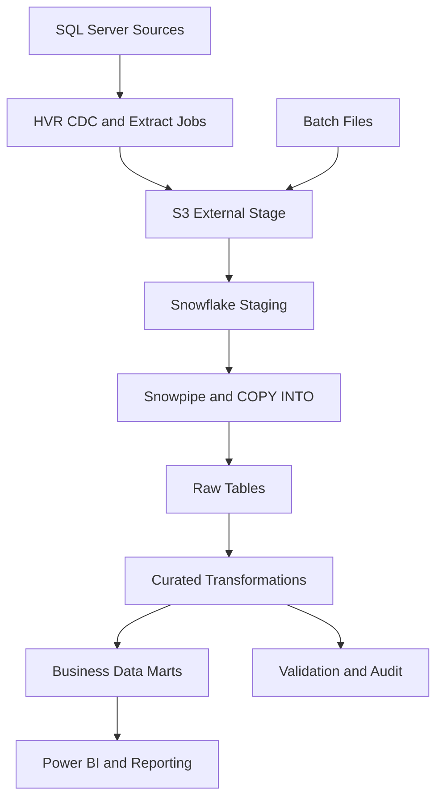

# Lavanya M - Azure Data Engineer

## Contact
- **Email:** lavanyam94088@gmail.com
- **Phone:** +91-7975300174
- **Location:** Bengaluru, India

## Profile Summary
Azure Data Engineer with **5 years of total experience**, including **4 years of hands-on expertise on Microsoft Azure** and **1 year of Snowflake data warehousing experience**. Skilled in designing, building, and optimizing scalable data pipelines and analytics platforms using **Azure Data Factory, ADLS Gen2, Azure Synapse Analytics, SQL, Python, and PySpark**.

Strong experience in dimensional modeling, ETL/ELT implementation, data quality validation, performance tuning, and cloud cost optimization. Proven ability to deliver secure, reliable, and business-ready data solutions through close collaboration with analysts, data scientists, and business stakeholders.

## Work Experience
### IT Analyst - Tata Consultancy Services
**Duration:** June 2025 - Present

### Software Engineer - CGI Inc Pvt
**Duration:** March 2024 - May 2025

### Member Technical Staff - HCL Technologies
**Duration:** February 2021 - March 2024

## Key Responsibilities Across Roles
- Designed, developed, and maintained scalable ETL/ELT pipelines using Azure Data Factory.
- Built and managed lake storage solutions in ADLS Gen2 for structured and semi-structured data.
- Developed analytical warehouse layers using Azure Synapse Analytics and optimized reporting schemas.
- Implemented dimensional models (star and snowflake schemas) for BI and analytics use cases.
- Built and optimized complex SQL queries, stored procedures, and views for high-performance reporting.
- Used Azure Databricks and PySpark for large-scale transformations and workload optimization.
- Implemented incremental loading, CDC, and watermark-based ingestion patterns.
- Developed reconciliation and audit frameworks for data quality and consistency checks.
- Automated operational and monitoring tasks with Python and scheduling mechanisms.
- Integrated CI/CD workflows using Azure DevOps and Git.
- Monitored and troubleshot pipelines using Azure Monitor, Log Analytics, and alerting setups.
- Implemented RBAC and managed identity-based secure access to enterprise data assets.
- Collaborated with cross-functional teams to convert business needs into technical implementations.
- Prepared technical documentation for data models, pipelines, and operational runbooks.

## Technical Skills
### Programming & Querying
- Python, SQL, PySpark

### Azure Data Engineering Services
- Azure Data Factory (ADF)
- Azure Databricks
- Azure Synapse Analytics

### Databases & Data Warehousing
- Azure SQL Database
- SQL Server
- Oracle
- Snowflake

### Data Storage & Lakehouse
- ADLS Gen2
- Azure Blob Storage
- Delta Lake

### File Formats & Data Handling
- Parquet, ORC, CSV, JSON, XML, Avro

### ETL / ELT & Data Processing
- Data pipeline design
- ETL/ELT development
- Incremental and full load processing
- Schema evolution handling

### Distributed Processing Concepts
- Partitioning
- Bucketing
- Shuffle optimization
- Broadcast joins
- Caching

### Orchestration & Scheduling
- ADF schedule triggers
- Event-based triggers
- Tumbling window triggers

### Data Quality & Monitoring
- Data validation
- Null and threshold checks
- Row count reconciliation
- Logging and alerting

### Performance & Cost Optimization
- Spark tuning
- SQL query optimization
- Cluster sizing
- Compute vs storage optimization

### Security & Governance
- Azure RBAC
- Managed identities
- Data masking
- PII handling
- Azure Key Vault (Basics)

### Version Control & DevOps
- Git
- GitHub
- Azure DevOps
- CI/CD concepts for data pipelines

### Architecture & Design
- Data Lakehouse Architecture
- Medallion Architecture (Bronze-Silver-Gold)
- Batch processing patterns

## Education
**Bachelor of Engineering in Computer Science**  
Malnad College of Engineering, VTU, Hassan, India

## Project Portfolio - Detailed Overview

### Project 1: Supply Chain Track and Trace Data Hub
This project established a centralized shipment intelligence platform to unify logistics events coming from external carriers and internal systems such as purchase order and warehouse operations databases. Data arrived in multiple formats including XML, EDI, JSON, and SQL extracts, and was orchestrated through Azure Data Factory into ADLS Gen2 raw storage. Databricks processing standardized event formats, normalized timestamps, mapped carrier-specific event codes to a canonical status model, and removed duplicates by composite event keys. The curated output created a trusted operational history of shipment movement that could be used consistently across analytics and operations teams.

The business value of the solution came from reducing blind spots in transit visibility and enabling faster exception handling. SLA and delay logic transformed raw movement events into actionable KPIs such as transit duration, ETA variance, and no-scan anomaly detection. Curated datasets were published to Synapse/SQL serving layers for Power BI and Tableau consumption, with audit and reconciliation controls applied at each stage. This design improved decision speed for logistics teams, reduced manual status tracking, and strengthened confidence in shipment performance reporting through traceable, run-level lineage.

| Table Name | Layer | Purpose | Key Columns |
|---|---|---|---|
| `fact_shipment_event` | Curated/Serving | Atomic shipment event history | `tracking_id`, `event_code`, `event_ts`, `carrier_id` |
| `fact_shipment_daily_snapshot` | Serving | Daily shipment status rollup | `snapshot_date`, `shipment_id`, `current_status` |
| `fact_delay_exception` | Serving | Delay and exception records for operations | `shipment_id`, `exception_type`, `eta_variance_days` |
| `dim_carrier` | Dimension | Carrier master and SLA attributes | `carrier_id`, `carrier_name`, `service_tier` |
| `dim_route` | Dimension | Route and lane metadata | `route_id`, `origin_region`, `destination_region` |
| `dim_warehouse` | Dimension | Warehouse location and hierarchy | `warehouse_id`, `dock_id`, `region` |
| `audit_pipeline_run` | Audit | Pipeline execution trace and status | `run_id`, `batch_id`, `status`, `start_ts`, `end_ts` |
| `audit_data_quality` | Audit | Rule-level quality outcomes | `run_id`, `rule_id`, `result`, `failed_count` |

### Project 2: Store-to-Web Inventory Reconciliation Pipeline
This project automated a reconciliation framework between physical store stock and e-commerce stock exposure to prevent customer-facing inventory errors. Inventory snapshots were sourced from on-prem Oracle retail systems and Azure SQL web inventory databases, while product and store master data provided mapping and context. ADF pipelines extracted and staged source data into ADLS, where standardization logic aligned SKU identities, normalized units of measure, and filtered inactive or invalid records. The reconciliation engine then compared store and web quantities by defined business keys and calculated absolute and percentage variance metrics.

Operationally, the platform enabled controlled actions for high-impact mismatches and eliminated delays caused by manual spreadsheet-based checks. Critical discrepancies triggered suppression workflows and exception notifications through Logic Apps, while regional and category-level reports provided actionable summaries for merchandising and store operations teams. The pipeline included robust validation and rerun capabilities, ensuring that late-arriving or failed partitions could be reprocessed without duplicating actions. Overall, the solution improved digital inventory accuracy, reduced oversell risk, and provided auditable governance across reconciliation decisions.

| Table Name | Layer | Purpose | Key Columns |
|---|---|---|---|
| `fact_inventory_reconciliation` | Curated | Base comparison output by SKU/store/channel | `business_date`, `store_id`, `sku_id`, `qty_delta` |
| `fact_inventory_discrepancy` | Curated/Serving | Classified mismatch records | `sku_id`, `store_id`, `severity`, `percentage_delta` |
| `fact_suppression_actions` | Operational | Trace of suppression or listing safeguards | `action_id`, `sku_id`, `reason_code`, `action_ts` |
| `dim_store` | Dimension | Store hierarchy and region mapping | `store_id`, `region`, `store_format` |
| `dim_product` | Dimension | Product reference and categorization | `sku_id`, `category`, `uom`, `active_flag` |
| `audit_reconciliation_run` | Audit | End-to-end job status and control metrics | `run_id`, `business_date`, `status`, `recon_count` |

### Project 3: Customer 360 and Segmentation Data Mart
This project delivered a governed Customer 360 data mart by integrating marketing engagement, CRM transactions, support interactions, and customer master records into one analytics-ready platform. ADF pipelines ingested structured and API-driven source data to ADLS raw zones, then Databricks processing standardized personal attributes, channel events, and timestamps. Identity resolution logic combined deterministic matching (email/phone/account) with fuzzy rules to produce a Golden Record per customer, backed by confidence scoring and survivorship policies. This ensured downstream analyses used consistent customer identity rather than fragmented source-level identifiers.

The resulting mart enabled segmentation and campaign analytics at scale by generating curated features such as recency, frequency, monetary value, engagement depth, and support burden indicators. Fact and dimension structures in Azure SQL supported both operational dashboards and strategic cohort analyses. Privacy controls such as column masking and role-based access were embedded in the serving layer so teams could consume customer intelligence safely by role. With automated quality certification and source-to-mart lineage, the platform increased trust in customer analytics and improved targeting precision for marketing and retention initiatives.

| Table Name | Layer | Purpose | Key Columns |
|---|---|---|---|
| `dim_customer` | Dimension | Golden customer profile and attributes | `golden_customer_id`, `email_hash`, `segment_code` |
| `dim_channel` | Dimension | Engagement and interaction channels | `channel_id`, `channel_name`, `channel_group` |
| `dim_campaign` | Dimension | Campaign metadata for attribution | `campaign_id`, `campaign_type`, `start_date` |
| `fact_customer_engagement` | Fact | Marketing event interactions | `golden_customer_id`, `campaign_id`, `open_flag`, `click_flag` |
| `fact_customer_transaction` | Fact | Revenue and order behavior | `golden_customer_id`, `order_id`, `order_amount`, `order_ts` |
| `fact_customer_support` | Fact | Service and issue resolution behavior | `golden_customer_id`, `ticket_id`, `csat_score`, `resolution_time` |
| `audit_customer360_run` | Audit | Pipeline and rule execution log | `run_id`, `source_name`, `dq_score`, `status` |

### Project 4: Snowflake Data Migration and Analytics Platform - Tandigm Health
This project modernized a legacy SQL Server analytics estate by migrating core data workloads into Snowflake and establishing a cloud-native ingestion and transformation operating model. Migration planning included source inventory, dependency analysis, wave-based cutover, and dual-run reconciliation to reduce risk. Historical datasets were bulk-loaded through staged files and parallel `COPY INTO` operations, while ongoing incremental feeds used CDC patterns via HVR and Snowpipe auto-ingestion. The environment was organized into staging, raw, curated, and mart layers with workload-specific warehouses and controlled access roles.

Beyond migration, the project focused on long-term platform reliability through standardized transformation patterns, quality gates, and cost-aware compute operations. Reconciliation checks validated row counts, key integrity, null thresholds, and business rule compliance before curated publication. Semantic views then exposed trusted datasets to BI consumers while masking policies protected sensitive healthcare-related attributes. The final platform delivered higher scalability, improved performance for reporting workloads, and strong governance through run metadata, alerting, and repeatable failure-recovery playbooks.

| Table Name | Layer | Purpose | Key Columns |
|---|---|---|---|
| `stg_<entity>` | Staging | Initial landed source records | `batch_id`, `load_ts`, `source_system` |
| `raw_<entity>` | Raw | Persisted source-aligned historical data | `source_pk`, `change_seq`, `ingest_ts` |
| `cur_<subject_area>` | Curated | Standardized and business-conformed datasets | `business_key`, `effective_from_ts`, `effective_to_ts` |
| `mart_<domain>_fact` | Mart | Analytics fact tables for BI workloads | `surrogate_key`, `metric_value`, `snapshot_date` |
| `mart_<domain>_dim` | Mart | Conformed dimensions for slicing and drill-down | `surrogate_key`, `business_code`, `is_current` |
| `audit_load_control` | Audit | Batch and load orchestration metadata | `batch_id`, `table_name`, `status`, `rows_loaded` |
| `audit_reconciliation` | Audit | Source-target validation outcomes | `table_name`, `rule_name`, `result`, `variance_pct` |

## Project Documents
Detailed standalone project documents are available in:
1. `project_01_supply_chain_track_trace_data_hub.md`
2. `project_02_store_to_web_inventory_reconciliation.md`
3. `project_03_customer_360_segmentation_data_mart.md`
4. `project_04_snowflake_data_migration_tandigm_health.md`
