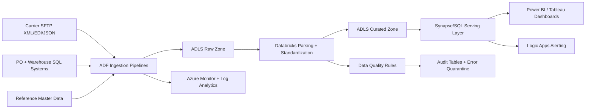

# Project 1: Supply Chain Track and Trace Data Hub

## 1) Project Summary
Built a centralized logistics data hub to consolidate shipment tracking events from external carriers and internal enterprise systems. The solution delivers a real-time operational view of merchandise movement, delay prediction, and exception reporting for supply chain teams.

## 2) Business Goals
- Create a single source of truth for shipment status.
- Reduce manual effort in tracking delays and exceptions.
- Improve ETA accuracy and SLA adherence.
- Provide reporting-ready datasets for Power BI and Tableau.

## 3) Data Sources
| Source | Type | Frequency | Landing Method | Key Fields |
|---|---|---|---|---|
| Carrier SFTP feeds | XML / EDI / JSON files | 15-min to hourly | ADF SFTP connector | tracking_id, event_code, event_ts, location |
| Internal PO system | Azure SQL Server | Hourly | ADF Copy activity | po_id, sku_id, warehouse_id, expected_delivery_date |
| Warehouse event system | Azure SQL Server | Near real-time batch | ADF + incremental watermark | warehouse_scan_ts, dock_id, shipment_id |
| Reference master data | CSV / SQL tables | Daily | ADF scheduled load | carrier_map, region_map, status_map |

## 4) High-Level Architecture

## 5) End-to-End Execution Flow

### Step 0: Pre-Run Controls
1. Validate source connectivity (SFTP, SQL endpoints).
2. Check previous batch completion flag.
3. Initialize `run_id`, `batch_id`, and watermark values.
4. Load runtime configuration from parameter table (carrier list, SLA threshold, retry rules).

### Step 1: Ingestion Orchestration (ADF)
1. Trigger starts on schedule and file-arrival events.
2. For each carrier, ADF copies inbound files from SFTP to ADLS raw path:
   - `raw/carrier=<id>/ingest_date=<yyyy-mm-dd>/`
3. Source files are checksummed and logged to ingestion audit table.
4. Invalid files are routed to `raw/rejected/` with error reason.

### Step 2: Raw Validation and Metadata Capture
1. Validate file naming convention and schema availability.
2. Perform record-level checks for mandatory fields.
3. Write ingestion metrics:
   - file_count, row_count, bad_row_count, ingest_latency
4. Register each file in control table for idempotent processing.

### Step 3: Parsing and Canonicalization (Databricks)
1. Parse XML/EDI hierarchical payloads into tabular event records.
2. Normalize timestamps to UTC and standardize timezone offsets.
3. Map carrier-specific status codes to canonical status taxonomy.
4. Deduplicate events using composite key:
   - `carrier_id + tracking_id + event_ts + event_code`
5. Persist canonical output to ADLS curated zone (Parquet/Delta).

### Step 4: Business Enrichment
1. Join canonical shipment events with PO and warehouse tables.
2. Add business attributes:
   - order_priority, promised_date, warehouse_region, customer_segment
3. Resolve key mismatches with mapping tables and survivorship rules.
4. Build shipment journey table with full lifecycle milestones.

### Step 5: KPI and Exception Logic
1. Compute transit KPIs:
   - `days_in_transit`
   - `eta_variance_days`
   - `event_gap_hours`
2. Apply SLA rules by carrier/route/service type.
3. Generate exception buckets:
   - delayed, stuck_in_transit, no_recent_scan, route_deviation
4. Publish exception summary table for operational users.

### Step 6: Serving Layer Publication
1. Load curated outputs into SQL serving schema.
2. Build incremental upsert process for shipment fact table.
3. Refresh reporting views:
   - shipment_status_current_vw
   - delay_exception_vw
   - carrier_sla_scorecard_vw
4. Expose certified datasets to BI tools.

### Step 7: Quality, Audit, and Reconciliation
1. Reconcile source vs curated row counts.
2. Validate uniqueness of shipment event keys.
3. Check logical consistency (dispatch <= delivery timestamps).
4. Write pass/fail quality status to audit dashboard.

### Step 8: Alerting and Operational Actions
1. Trigger alerts when delay rate exceeds threshold.
2. Notify operations via Logic Apps email/Teams integration.
3. Produce rerun manifest for failed carrier batches.
4. Archive run logs and close batch with completion status.

## 6) Data Model (Target)
- `fact_shipment_event`
- `fact_shipment_daily_snapshot`
- `dim_carrier`
- `dim_route`
- `dim_warehouse`
- `fact_delay_exception`
- `audit_pipeline_run`
- `audit_data_quality`

## 7) Security and Governance
- RBAC by zone: raw, curated, serving.
- Managed Identity for ADF and Databricks access.
- Secrets and credentials stored in Azure Key Vault.
- PII-sensitive columns masked in serving views.
- Full run lineage retained by `run_id` and `batch_id`.

## 8) Failure and Recovery Strategy
- Retry policy (up to 3 attempts) for transient source/network errors.
- Dead-letter path for corrupt files with replay support.
- Idempotent processing by file hash and control table checkpoint.
- Backfill utility for date-range reprocessing.

## 9) Execution Schedule
- Incremental ingestion: every 15 minutes.
- Curated transformation: every 30 minutes.
- KPI publication: hourly.
- SLA scorecard and executive summary: daily at 06:00.

## 10) Outcomes
- Unified shipment visibility across carrier and internal systems.
- Faster delay detection and escalation for logistics teams.
- Reduced manual reconciliation through automated quality checks.
- Improved report performance via curated partitioned serving layer.