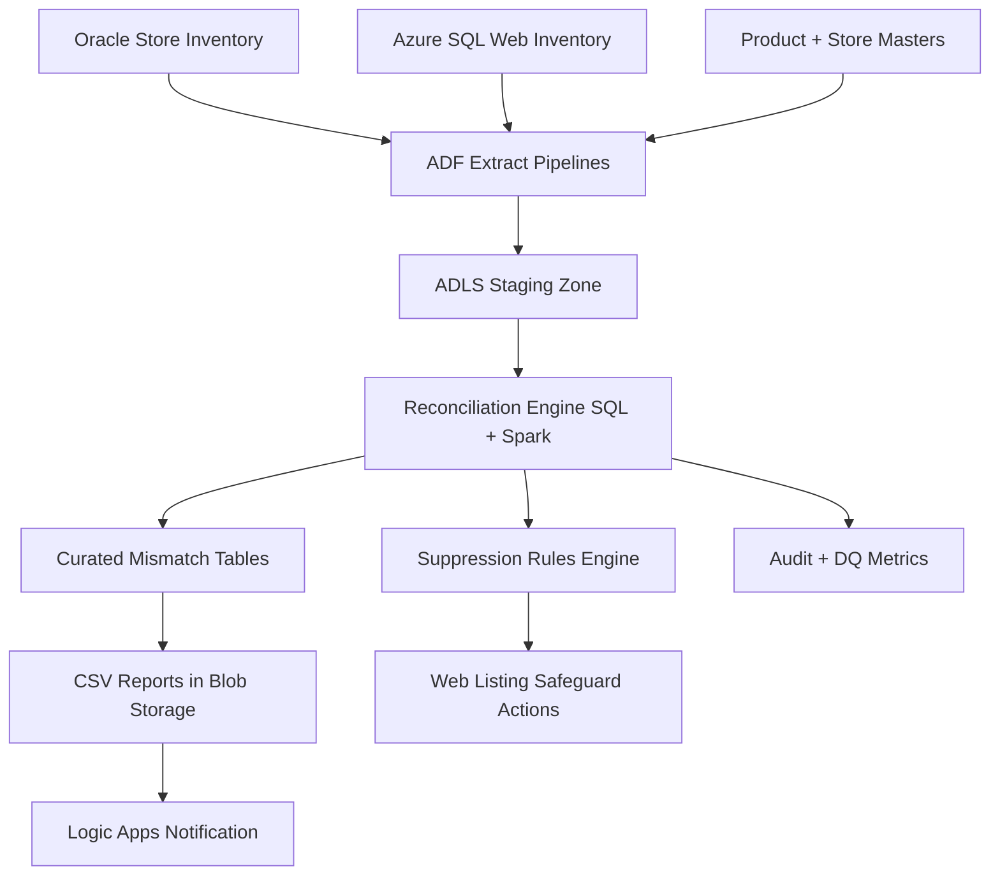

# Project 2: Store-to-Web Inventory Reconciliation Pipeline

## 1) Project Summary
Implemented an automated reconciliation platform to compare physical store inventory against e-commerce inventory, detect SKU-level mismatches, and trigger corrective actions before customer-facing impact.

## 2) Business Goals
- Improve online inventory accuracy.
- Reduce oversell and stockout scenarios.
- Automate discrepancy reporting and distribution.
- Enforce operational controls for critical mismatch categories.

## 3) Data Sources
| Source | Type | Frequency | Ingestion Method | Key Fields |
|---|---|---|---|---|
| On-prem Oracle retail DB | Transactional tables | End-of-day + intraday | ADF self-hosted integration runtime | store_id, sku_id, on_hand_qty, reserved_qty |
| Web inventory DB (Azure SQL) | Operational tables | Hourly | ADF copy / SQL extraction | sku_id, web_available_qty, web_reserved_qty |
| Product master data | SQL/CSV | Daily | ADF scheduled load | sku_id, category, uom, active_flag |
| Store hierarchy | SQL table | Daily | ADF scheduled load | store_id, region, format, timezone |

## 4) High-Level Architecture

## 5) End-to-End Execution Flow

### Step 0: Pre-Execution Setup
1. Initialize job context (`run_id`, `business_date`, `batch_window`).
2. Validate source job completion signals from retail systems.
3. Load control thresholds (critical variance %, minimum qty delta).
4. Confirm required reference datasets are present and current.

### Step 1: Source Extraction
1. Extract end-of-day snapshot from Oracle by store and SKU.
2. Extract current online inventory from Azure SQL.
3. Apply incremental filter for intraday reruns when enabled.
4. Persist extraction counts and source checksum metrics.

### Step 2: Staging and Standardization
1. Land datasets to ADLS staging:
   - `stage/store_inventory/date=<yyyy-mm-dd>/`
   - `stage/web_inventory/date=<yyyy-mm-dd>/`
2. Normalize UOM and SKU identifiers using master maps.
3. Remove inactive SKUs and invalid store mappings.
4. Flag suspicious records for quarantine (negative quantities, null keys).

### Step 3: Reconciliation Processing
1. Join store and web inventory on `sku_id + store/channel mapping`.
2. Calculate key comparison measures:
   - absolute_qty_delta
   - percentage_delta
   - sellable_qty_delta
3. Classify mismatches:
   - critical: delta above strict threshold
   - major: moderate impact
   - minor: informational variance
4. Apply business exceptions (in-transit stock, pending adjustments).

### Step 4: Rule Engine and Safeguards
1. Evaluate suppression rules for critical mismatches.
2. Create suppression instruction file with reason codes.
3. Trigger controlled update for affected web listings.
4. Store reversible action log for rollback/approval workflows.

### Step 5: Report Generation
1. Generate outputs:
   - store-level discrepancy report
   - category-wise discrepancy summary
   - critical SKU action report
2. Write reports to Blob storage partitioned by business date and region.
3. Publish metadata in audit table for report traceability.

### Step 6: Notifications and Workflow Integration
1. Trigger Logic Apps with report links and summary metrics.
2. Route notifications to operations, store teams, and merchandising.
3. Include high-priority exception list in alert payload.

### Step 7: Validation and Reconciliation Audit
1. Reconcile source extraction counts vs staged records.
2. Validate one-to-one reconciliation coverage for active SKU-store pairs.
3. Record mismatch trend metrics for KPI dashboard.
4. Mark run as success/failure with detailed status code.

### Step 8: Monitoring and Recovery
1. Monitor end-to-end duration vs SLA window.
2. Alert on failures, late starts, and excessive mismatch spikes.
3. Provide rerun by region/store partition for partial recovery.
4. Close run and archive operational logs.

## 6) Output Datasets
- `fact_inventory_reconciliation`
- `fact_inventory_discrepancy`
- `fact_suppression_actions`
- `dim_store`
- `dim_product`
- `audit_reconciliation_run`

## 7) Security and Compliance
- Least-privilege RBAC for extraction and reporting layers.
- Secure connection via self-hosted IR and managed identities.
- PII not exposed in discrepancy reports.
- Audit history retained for operational governance.

## 8) Failure Handling
- Retry transient extraction failures automatically.
- Isolate corrupt partitions into quarantine for manual review.
- Use checkpoint-based rerun to avoid duplicate posting.
- Rollback mechanism for suppression actions.

## 9) Execution Cadence
- Primary EOD batch: daily after store close.
- Optional intraday delta run: hourly for critical categories.
- Executive exception summary: daily morning distribution.

## 10) Outcomes
- Improved inventory consistency across store and online channels.
- Reduced overselling risk via automated safeguards.
- Faster issue resolution through scheduled discrepancy alerts.
- High-trust reconciliation process with complete auditability.