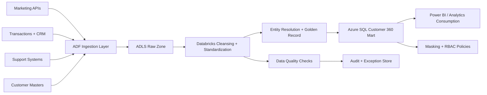

# Project 3: Customer 360 and Segmentation Data Mart

## 1) Project Summary
Designed and delivered a Customer 360 platform by consolidating marketing, transaction, and support-system data into a governed data mart for analytics, segmentation, and campaign targeting.

## 2) Business Goals
- Create a unified and trusted customer profile.
- Enable analytics-ready segmentation attributes.
- Improve campaign precision and response tracking.
- Enforce masking and access controls for sensitive attributes.

## 3) Data Sources
| Source | Type | Frequency | Ingestion Method | Key Fields |
|---|---|---|---|---|
| Email marketing platforms | REST API | Hourly | ADF REST connector | email_id, open_rate, click_rate, campaign_id |
| CRM / transaction systems | SQL tables | Hourly / daily | ADF SQL copy | customer_id, order_id, order_amount, order_ts |
| Support ticketing system | API / exports | 4-hourly | ADF API + staged files | ticket_id, csat_score, issue_type, resolution_time |
| Customer master/reference | SQL/CSV | Daily | ADF scheduled load | email, phone, account_id, demographic attributes |

## 4) High-Level Architecture

## 5) End-to-End Execution Flow

### Step 0: Run Initialization
1. Trigger schedule and compute processing window.
2. Read source-specific watermark values.
3. Initialize run metadata (`run_id`, `pipeline_version`, `load_type`).
4. Validate API tokens and database connectivity.

### Step 1: Multi-Source Ingestion
1. Pull campaign engagement events from marketing APIs.
2. Extract transaction/order data from CRM and sales systems.
3. Ingest support ticket metrics and customer satisfaction data.
4. Capture source-level audit metrics (records, latency, API response status).

### Step 2: Raw Zone Landing
1. Land source extracts to ADLS raw folders partitioned by source/date.
2. Persist source snapshots for replay and traceability.
3. Store ingestion metadata in control tables.
4. Route malformed payloads to error zone.

### Step 3: Cleansing and Standardization (Databricks + Python)
1. Standardize names, addresses, phone/email formats.
2. Normalize timestamps and channel event taxonomies.
3. Apply null handling and defaulting logic for incomplete records.
4. Validate critical fields and publish data quality score.

### Step 4: Identity Resolution and Golden Record
1. Match customer entities across systems using deterministic and fuzzy rules:
   - exact email/phone match
   - normalized name + address similarity
   - account linkage mapping
2. Assign `golden_customer_id` and confidence score.
3. Apply survivorship rules to choose best attribute values.
4. Persist Golden Record table for downstream joins.

### Step 5: Feature Engineering for Segmentation
1. Create customer behavior features:
   - recency, frequency, monetary (RFM)
   - engagement depth and channel affinity
   - support burden and satisfaction trends
2. Build derived flags (high value, churn risk proxy, reactivation candidate).
3. Store feature sets in curated mart tables.

### Step 6: Data Mart Modeling
1. Build dimensional model in Azure SQL:
   - `dim_customer`
   - `dim_channel`
   - `dim_campaign`
   - `fact_customer_engagement`
   - `fact_customer_transaction`
   - `fact_customer_support`
2. Publish conformed KPI views for BI.
3. Optimize indexing for segmentation and cohort analytics.

### Step 7: Privacy, Masking, and Governance
1. Mask sensitive columns (PII) for restricted roles.
2. Apply RBAC by consumer type (marketing, analytics, support).
3. Log access paths for governed data consumption.
4. Maintain lineage from source record to curated customer profile.

### Step 8: Quality Validation and Certification
1. Perform row-count and key-integrity reconciliation by source.
2. Validate Golden Record uniqueness and attribute completeness.
3. Compare KPI outputs vs prior period drift thresholds.
4. Certify data mart publish when all quality checks pass.

### Step 9: Monitoring and Alerting
1. Monitor freshness SLAs and pipeline health.
2. Alert on source delays, schema drift, and quality rule failures.
3. Generate daily run summary for platform and analytics teams.

## 6) Operational Runbook
- Full load: weekly (off-peak).
- Incremental load: hourly for high-priority sources.
- Backfill mode: date-range replay with source watermark override.
- Incident handling: isolate failed source, continue independent source pipelines.

## 7) Failure and Recovery
- Automatic retries for API timeout and transient failures.
- Dead-letter queue for invalid payloads.
- Partition-level rerun capability without full pipeline replay.
- Golden Record recompute utility for targeted identity-fix backfills.

## 8) Outcomes
- Delivered a governed single-customer-view platform.
- Improved segmentation precision with richer feature engineering.
- Reduced analyst effort through certified conformed views.
- Increased trust in campaign and customer performance reporting.