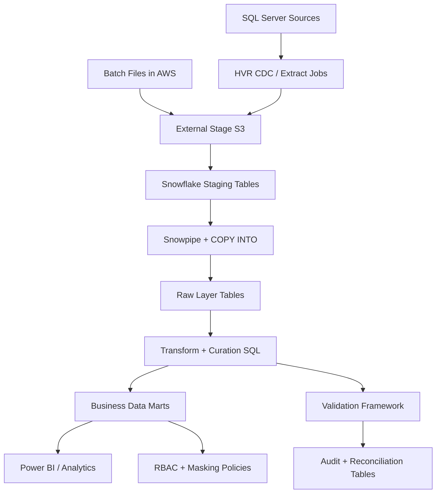

# Project 4: Snowflake Data Migration and Analytics Platform - Tandigm Health

## 1) Project Summary
Delivered a full-scale migration from SQL Server to Snowflake and built an analytics platform with automated ingestion, curated modeling, validation controls, and governed consumption for BI and reporting teams.

## 2) Business Goals
- Migrate legacy analytics workloads to cloud-native Snowflake.
- Automate both historical and incremental data ingestion.
- Improve query performance and operational scalability.
- Provide validated, governed, analytics-ready datasets.

## 3) Data Sources
| Source | Type | Frequency | Ingestion Method | Key Fields |
|---|---|---|---|---|
| SQL Server OLTP/ODS | Relational tables | Initial full + ongoing deltas | HVR CDC + staged files | business keys, tx timestamps, status columns |
| Batch extracts | CSV/Parquet | Daily | AWS stage + Snowflake COPY | entity snapshots, aggregates |
| Reference data | SQL/CSV | Daily/weekly | Bulk load to staging tables | code maps, dimensions |
| Operational metadata | control tables | Per run | Stored procedures/tasks | batch_id, load_ts, source_lsn |

## 4) High-Level Architecture

## 5) End-to-End Execution Flow

### Step 0: Migration Planning and Readiness
1. Inventory source SQL Server schemas, table volumes, and dependencies.
2. Classify entities by criticality and migration wave.
3. Define full-load and incremental cutover strategy.
4. Prepare rollback and dual-run validation plan.

### Step 1: Snowflake Environment Provisioning
1. Create databases, schemas, virtual warehouses by workload tier.
2. Configure roles and grants for ingestion, transform, and consumption.
3. Set up internal and external stages.
4. Register file formats and copy options for CSV/Parquet.

### Step 2: Data Model and DDL Deployment
1. Translate logical/physical model to Snowflake DDL.
2. Create staging, raw, curated, and mart layers.
3. Define primary business keys and surrogate key strategy.
4. Deploy DDL through controlled CI/CD release process.

### Step 3: Historical Backfill (Bulk Load)
1. Extract historical data from SQL Server to staged files.
2. Load files using parallel COPY operations.
3. Validate record counts and checksum/hashing across source-target.
4. Capture load metrics and reconciliation status per table.

### Step 4: Incremental Ingestion Automation
1. Enable CDC feed using HVR pipelines.
2. Push changed data to stage and auto-ingest via Snowpipe.
3. Apply merge/upsert logic into raw and curated tables.
4. Maintain idempotency using source LSN/change sequence markers.

### Step 5: Transformation and Curation
1. Execute SQL transformations for standardization and conformance.
2. Apply business rules, type harmonization, and null defaults.
3. Build curated subject-area marts for analytics consumers.
4. Refresh dependent materialized views / derived tables.

### Step 6: Validation and Reconciliation
1. Run source-target reconciliation checks:
   - row count validation
   - key uniqueness
   - null threshold validation
   - business rule checks
2. Log failures with rule code and impact level.
3. Block downstream publish when critical checks fail.

### Step 7: Performance and Cost Tuning
1. Tune warehouse sizes per workload profile.
2. Configure auto-suspend and auto-resume for cost control.
3. Optimize heavy queries and prune unnecessary scans.
4. Shift non-critical jobs to off-peak windows.

### Step 8: Consumption Enablement
1. Publish semantic views for BI and analyst teams.
2. Provide governed access by domain and role.
3. Document KPI definitions and data contracts.

### Step 9: Monitoring and Operations
1. Track load latency, pipeline failures, and freshness SLA.
2. Alert on Snowpipe lag, task failures, and quality breaches.
3. Generate daily operational run summaries.
4. Maintain playbooks for rerun and incident resolution.

## 6) Execution Scheduling
- Historical load: one-time wave-based execution.
- CDC incremental ingestion: near real-time (minutes).
- Curated transformation jobs: hourly.
- Reconciliation and publish certification: every cycle.

## 7) Security and Governance
- Role-based access across staging, raw, curated, and marts.
- Masking policies for sensitive healthcare/business attributes.
- Least privilege for service roles and pipelines.
- End-to-end auditability using run control metadata.

## 8) Failure and Recovery Strategy
- Retry transient stage/load failures automatically.
- Isolate failed entities and continue independent table processing.
- Support table-level backfill without full environment rollback.
- Retain reproducible load manifests for controlled replay.

## 9) Outcomes
- Successfully migrated SQL Server analytical workloads to Snowflake.
- Reduced manual load operations through Snowpipe automation.
- Improved query performance and scalability for reporting.
- Delivered trusted, validated, and governed datasets for decision-making.